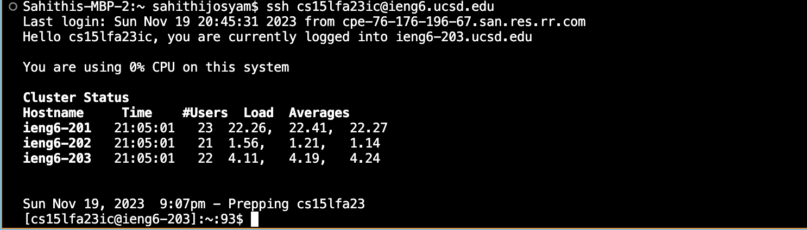
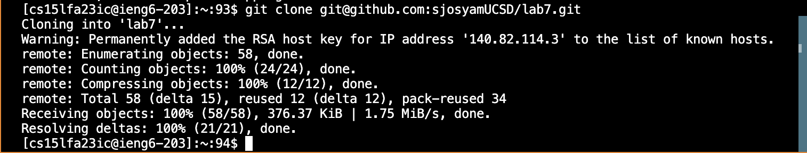
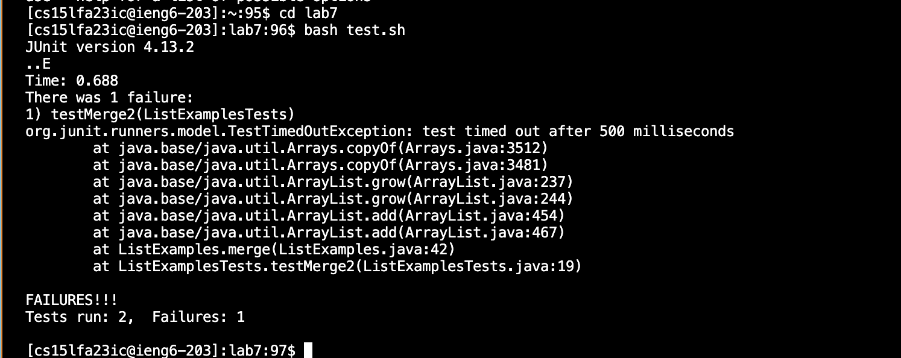
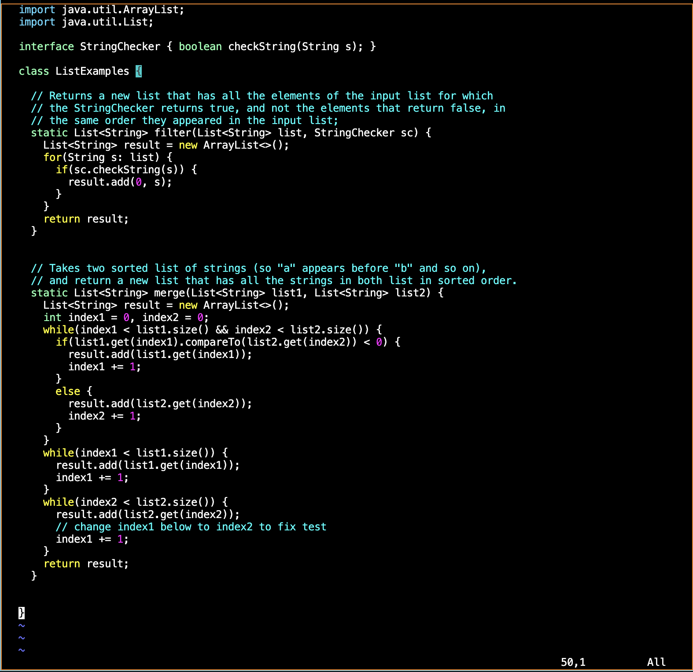
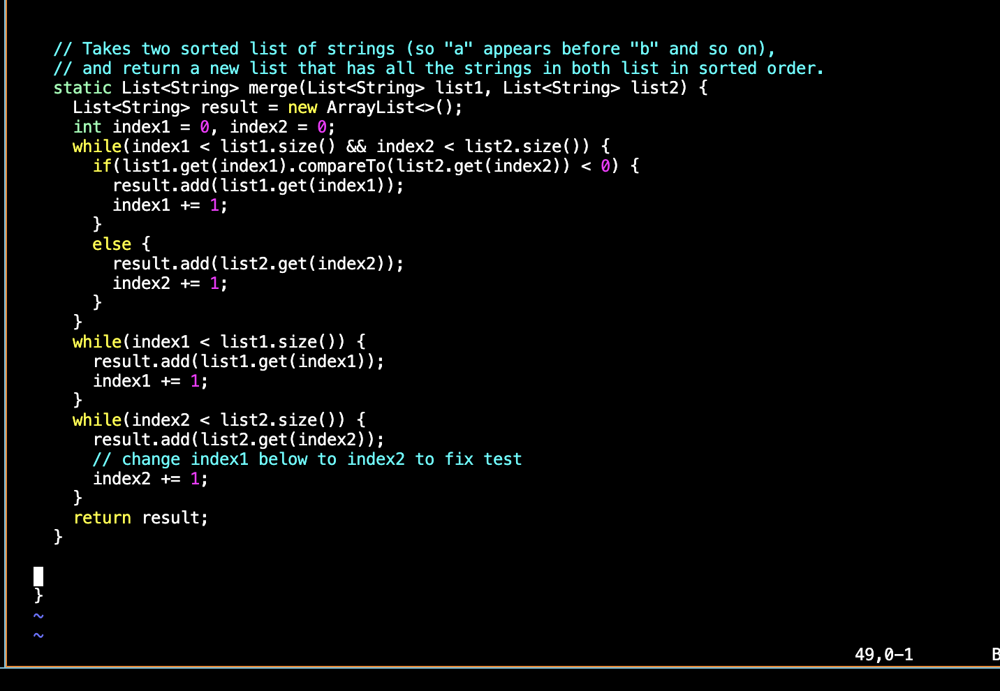
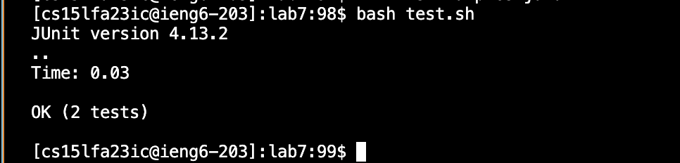
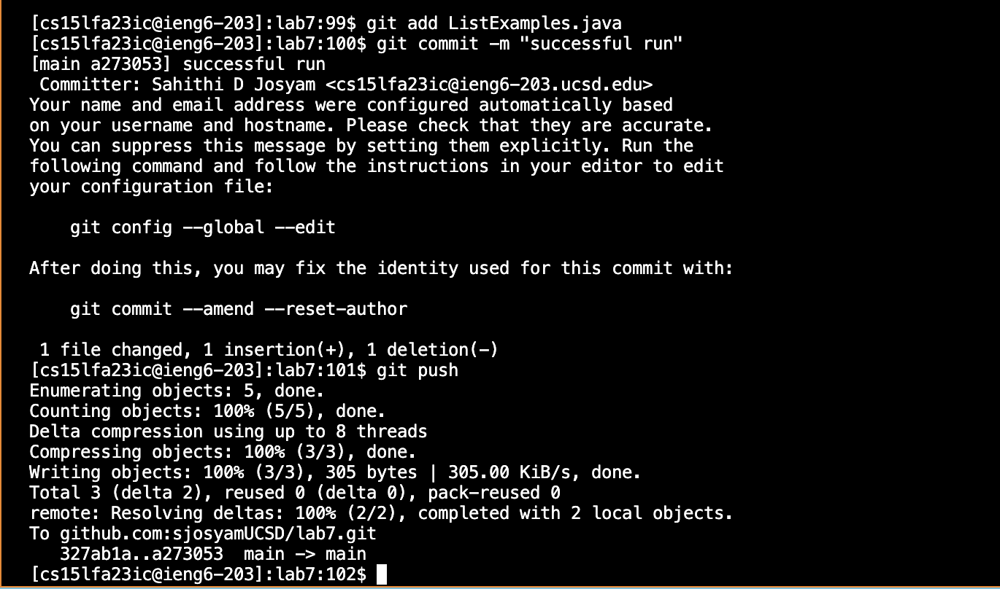

**Logging into ieng6**
To log into ieng6, I typed `ssh cs15lfa23ic@ieng6.ucsd.edu` then `<enter>`to execute. 

**Cloning fork of the repository using the SSH URL**
To do this, I typed `git clone git@github.com:sjosyamUCSD/lab7.git` then `<enter>` to execute. 

**Running the tests and demonstrating that they fail**
Here, I typed `cd lab7<enter>` followed by `bash test.sh<enter>`

**Editing the code file to fix the failing test**
After typing `vim ListExamples.java<enter>`, I was led to the following:

To fix the code, I typed `<shift+g>` to jump to the bottom and went to the line to be fixed by using `<up><up><up><up><up><up>`.
Then, I used <shift+e> to jump to the character, `<i>` to enter insert mode, then `<right><backspace><2><esc>`, to change the index accordingly.
Finally, I typed `<:wq><enter>` to save and exit out. 

**Re-running the tests to demonstrate that they work**
By pressing `<up><up><enter>` to run the command that was two up in my history, I was able to rerun the tests and show that they now work. 

**Committing and pushing the changes**
By typing `git add ListExamples.java<enter>` and `git commit -m "successful run"<enter>` I was able to commit and add a message. The `git add` command allows the user to include updates to a particular file in the next commit. However, the change is not recorded until the `git commit` command is also run. 
Then, I pushed the change onto Github by typing `git push<enter>`. This is shown in the image below. 

